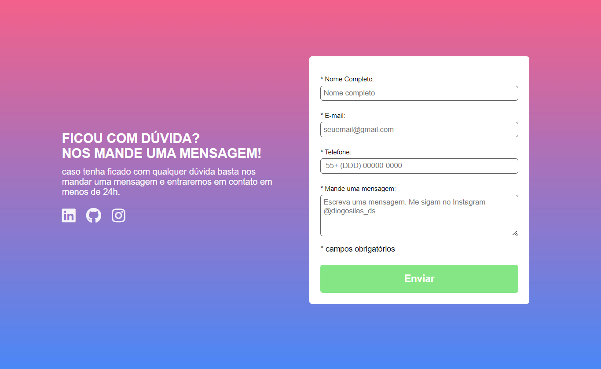

<h1 align="center">Validation Form</h1>

projeto foi criado com o propósito de exibir uma mensagem "* campo obrigatório" abaixo do campo do formulário, caso o usuário deixe algum campo em branco. Quando preenchidos, os campos são destacados em verde. Entretanto, é importante notar que o código JavaScript implementado neste projeto não atende aos padrões exigidos pelo ambiente profissional.

## Tecnologias Utilizadas
- JavaScript - JS é uma linguagem de programação amplamente utilizada para desenvolvimento web. Versátil e dinâmica, executa no navegador do usuário, permitindo interatividade e manipulação de conteúdo em tempo real.
- Hyper Text Markup Language - HTML5 é a linguagem de marcação que viabiliza a criação de código semântico, de manutenção simplificada e legibilidade
- Cascading Style Sheets - CSS3, a linguagem de folha de estilo em cascata, é a força motriz por trás da criação de efeitos estéticos na página, englobando a manipulação de textos, imagens e adaptabilidade responsiva.

## Como Utilizar?
Preencha todos os campos obrigatórios e precione o botão "Enviar".